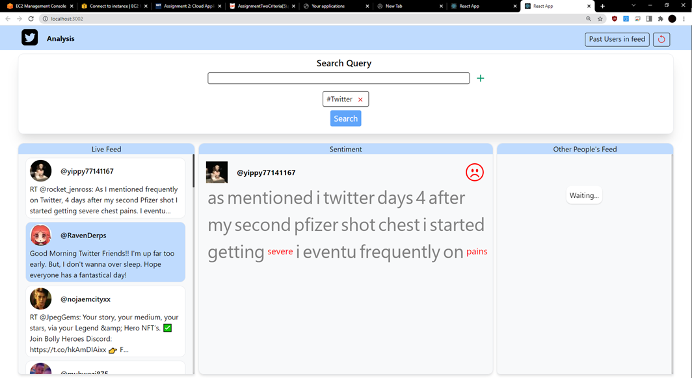
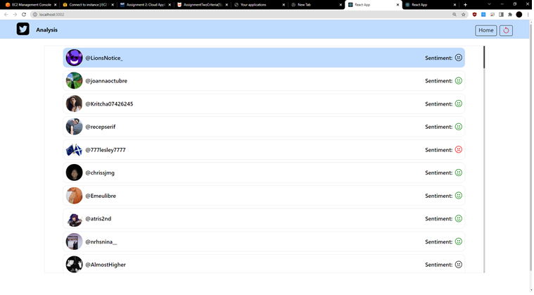
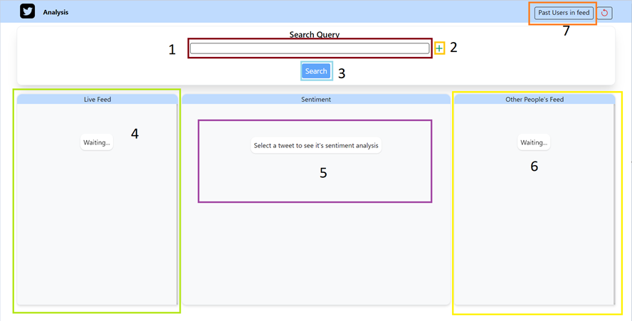
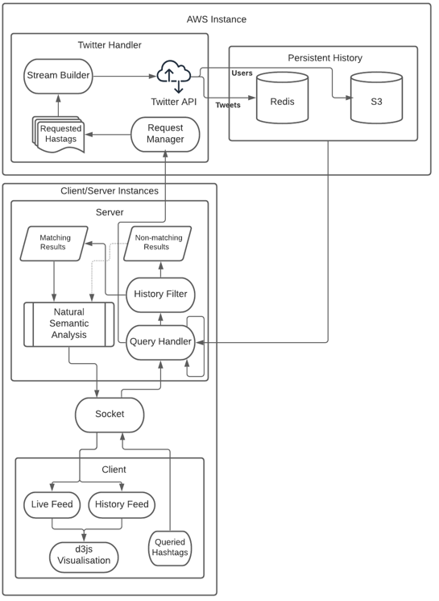

# Cloud Computing Assignment 2  - QUT
## Group Assignment - Matthew Weir, Ethan Tracy
### This application is not live.

The app we have created is a Twitter Analyser, where users can enter search terms and get a real-time stream of results as they are posted. Once inspecting the results, users are also provided with the sentiment analysis of the chosen tweet. Using this tool, it is possible to make observations of public opinion on a topic as events unfold, which can provide users with a unique insight on live events. The most noteworthy part of our application would have to be in its architecture, where we utilize two separate servers and socket.io connections in order to bypass the Twitter API’s limitation of only allowing one stream to be open at a time.
  
  

## AWS
This application was also containerised using Docker, Hosted on AWS & Put in an automatic scaling group to handle higher load.

## User Guide 
Using the application is quite straight forward. When you first load the page, you are greeted by a search box, three empty panels and a header. To start receiving tweets, enter a query into the search box (1), click the ‘+’ on the right side of the box (2) and click search to send your quer(y/ies) (3). To remove hashtags, simply click on the cross beside its tag below the search bar.
Once the stream finds tweets matching your query you will see them populating the feed panel (4). If there are any concurrent users, you will also see their tweets appearing in the history panel (6). You can view the sentiment analysis by clicking on any of the tweets that you see (5). This will display a word cloud and emoji representing the calculated sentiment.
To view the users page, click on the button in the top right in the header (7). This will fetch and display a list of users that have appeared in the feeds, as well as showing the sentiment of their tweets. 

  

  

## For more information please see the report.pdf in the root directory

### All old API keys have been deleted, All AWS instances for the Elasticache/AWS s3 Bucket have been shut down. 

